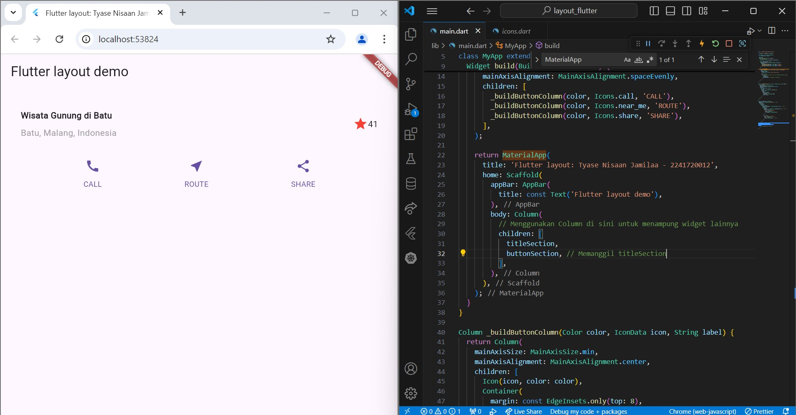

# **layout_flutter**

A new Flutter project.

---

Nama: Tyase Nisa'an Jamilaa

Kelas: 3H

Absen: 26

---

# Praktikum 1: Membangun Layout di Flutter

### **Langkah 1: Buat Project Baru**

### **Langkah 2: Buka File lib/main.dart**

### **Langkah 3: Identifikasi Layout Diagram**

### **Langkah 4: Implementasi Title Row**

---

# Praktikum 2: Implementasi Button Row

### **Langkah 1: Buat method Column buildButtonColumn**

### **Langkah 2: Buat widget buttonSection**

### **Langkah 3: Tambah button section ke body**

---

# Praktikum 3: Implementasi Text Section

### **Langkah 1: Buat widget textSection dan ambahkan variabel text section ke body**

---

# Praktikum 4: Implementasi Image Section

### **Langkah 1: Siapkan aset gambar**

### **Langkah 2: Tambahkan gambar ke body**

### **Langkah 3: Terakhir, ubah menjadi ListView**

